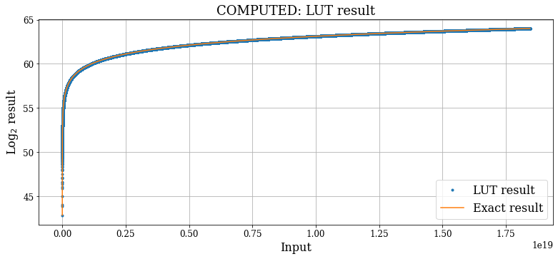
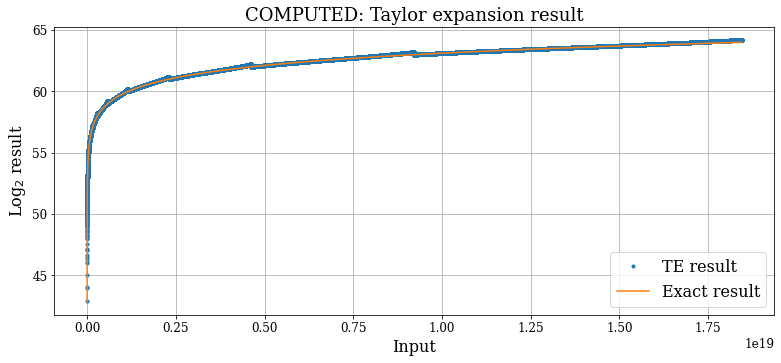

# Base2_Log  

 ## Code 

The repository is organized as follows:
- **`code_generator.py`**: script that automatically generates the verilog file of a AXI4 lite compliant base2 logarithm;
- **`LUT_LOG.v`**: output verilog file;
- **`LOG_tests.ipynb`**: notebook which contains some tests;  
- **`PYNQ_overlays_files`**: files thal will be loaded in the PYNQ-Z2 board;
- **`PYNQ_notebook`**: python notebook with some tests on the PYNQ board;  

In the future the PYNQ project will be added, in which some random inputs will be sent to the PL via a DMA, then the log will be computed and the result array will be sent back (via DMA again) and the error will be evaluated.  

    

    

